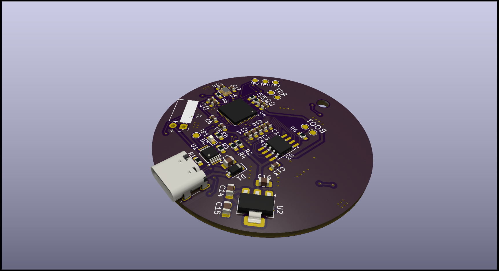
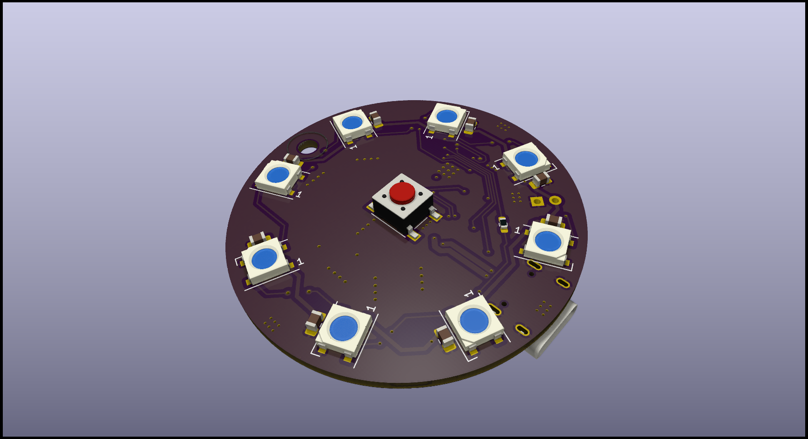
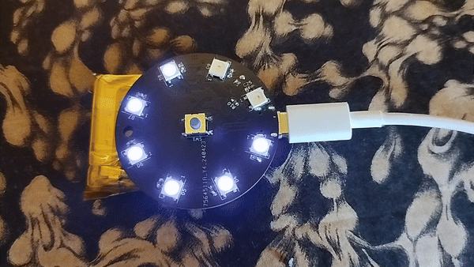

# LedRingHardware


## Description

LedRingHardware is a simple PCB devBoard based on the RP2040 microcontroller, featuring 8 programmable LEDs and battery supply. This project was created to explore the capabilities of MicroPython and CircuitPython.

## Visualization
<p align="center">
  
&nbsp; &nbsp; &nbsp; &nbsp;
  
</p>

## Installation

- Enter to **BOOTSEL** mode connect **boot** testpoints placed close to **U3** chip.
- Download CircuitPython firmware for rp2040. There is avaliable [here](https://downloads.circuitpython.org/bin/raspberry_pi_pico/pl/adafruit-circuitpython-raspberry_pi_pico-pl-9.1.1.uf2) or for latest version go to [CircuitPython](https://circuitpython.org/) site.
- Copy `.uf2` firmware to device

## Example code

```python

import board
import time
import neopixel

LED_NUMBER = 8
BUTTON_PIN = board.GP22
LED_PIN = board.GP13

COLOR = (10,0,15)
disp_pix = neopixel.NeoPixel(LED_PIN, LED_NUMBER, auto_write=False)

while True:
	for i in range(LED_NUMBER):
		disp_pix[i] = COLOR
		disp_pix.show()
		time.sleep(0.1)
		
	for i in range(LED_NUMBER):
		disp_pix[i] = (0,0,0)
		disp_pix.show()
		time.sleep(0.1)
```

Expected results will be that:




